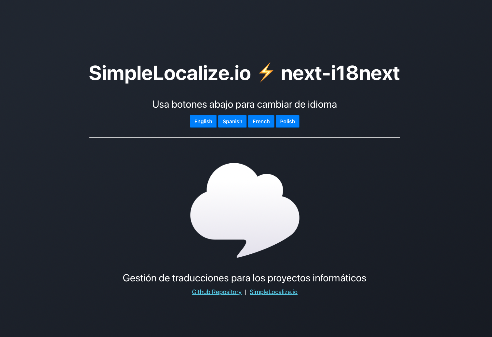

This is a [Next.js](https://nextjs.org/) project bootstrapped with [`create-next-app`](https://github.com/vercel/next.js/tree/canary/packages/create-next-app).

## Translations location

Translations are placed in `/public/locales/{lang}/{ns}.json`

- `{ns}` - namespace, allows you to split translation keys into multiple files
- `{lang}` - language

In this example there are two namespaces: `common` and `home` and 4 locales: `en`, `es`, `fr_FR`, `pl`.

## i18next configuration

```bash
npm install --save next-i18next
```

```typescript
// 📦 file: ./next-i18next.config.js
module.exports = {
  i18n: {
    defaultLocale: 'en',
    locales: ['en', 'es', 'pl', 'fr_FR'],
  },
};
```

## NextJS + i18n configuration

```typescript
// 📦 file: ./next.config.js
const {i18n} = require("./next-i18next.config");
const nextConfig = {
  reactStrictMode: true,
  i18n
}

module.exports = nextConfig
```

## SimpleLocalize configuration

Download translations to `./public/locales` directory
```bash
simplelocalize download
```

Upload translations from `./public/locales` directory
```bash
simplelocalize upload
```

```shell
# 📦 file: ./simplelocalize.yml
apiKey: YOUR_PROJECT_API_KEY
downloadFormat: single-language-json
downloadPath: ./public/locales/{lang}/{ns}.json

uploadFormat: single-language-json
uploadPath: ./public/locales/{lang}/{ns}.json
```

> You can [automate process of adding translation keys](https://simplelocalize.io/docs/integrations/i18next/) from project to SimpleLocalize.

## Usage

Example usage can be found in `pages/index.tsx`.

```typescript
//translations from common.json
const {t} = useTranslation('common');
console.log(t('LEARN_MORE')) // output: Learn more

//translations from home.json
const {t: homeT} = useTranslation('home');
console.log(homeT('HELLO_WORLD')) // output: Hello world
```

## Try out this demo

First, run the development server:

```bash
npm run dev
```

Open [http://localhost:3000](http://localhost:3000) with your browser to see the result.

You can start editing the page by modifying `pages/index.tsx`. The page auto-updates as you edit the file.

